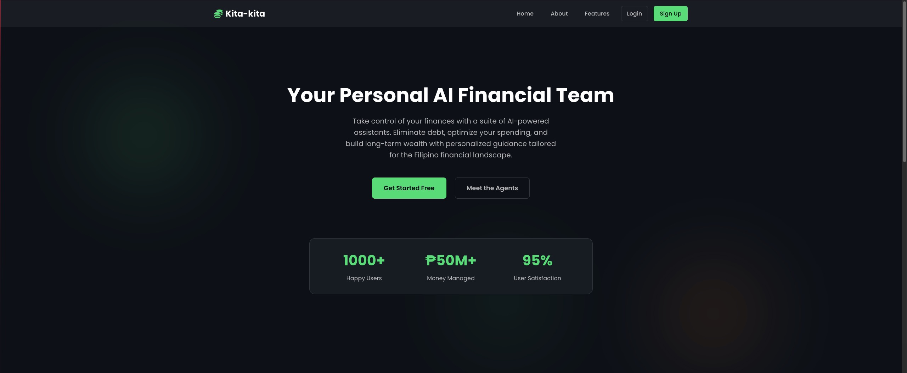

# 🏦 Kita-kita - AI Banking Platform

### Kita-kita: Your AI Financial Co-pilot



Kita-kita is a comprehensive AI-powered financial platform designed to empower Filipinos to take control of their financial lives. It features a suite of intelligent AI agents—the Debt Demolisher, Cashflow Optimizer, and Wealth Builder—that provide personalized guidance on everything from debt management to investment strategies. By combining modern web technology with a deep understanding of the Philippine financial context, Kita-kita makes expert financial advice accessible to everyone.

## 🛠️ Tech Stack

-   **Frontend**: HTML5, CSS3, JavaScript (ES6+)
-   **Backend**: Node.js, Express.js
-   **Database**: Firebase Firestore
-   **AI**: Llama 3 (local)
-   **Authentication**: Firebase Authentication
-   **Deployment**: Firebase Hosting (implied)
-   **Libraries**: Chart.js, Helmet, Express Rate Limit
-   **Development Tools**: Jest, Nodemon, Sentry

## Table of Contents
1. [Features](#features)
2. [Usage Guide](#usage-guide)
3. [Quick Start](#quick-start)
4. [Repository Structure](#repository-structure)
5. [Team Members](#team-members)

## Features

- **🤖 AI Financial Agents**: Take control of your finances with a suite of AI-powered assistants:
    -   **Debt Demolisher**: Creates a personalized, automated debt-elimination plan using proven strategies like the Avalanche and Snowball methods.
    -   **Cashflow Optimizer**: Analyzes spending habits, detects recurring subscriptions, and provides actionable tips to increase your savings.
    -   **Wealth Builder**: Delivers long-term investment guidance tailored to the Philippine financial landscape, including local options like UITFs and Pag-IBIG MP2.

- **💰 Comprehensive Financial Management**:
    -   **Transaction Tracking**: Easily add, track, and categorize your income and expenses.
    -   **Bank & E-Wallet Integration**: Manage all your accounts from a single, unified dashboard.
    -   **Subscription Management**: Identify and optimize all your recurring payments.

- **📊 Advanced Analytics & Insights**:
    -   **Financial Analytics**: Visualize your financial health with real-time charts and dashboards.
    -   **Expense Forecasting**: Leverage AI-powered predictions to anticipate future spending.
    -   **Financial Time Machine**: Simulate different financial scenarios to make informed decisions.

## Usage Guide

1.  **Create an Account**: Sign up or log in to the platform.
2.  **Navigate the Dashboard**: Get a complete overview of your finances, including total balance, income vs. expenses, and recent transactions.
3.  **Link Your Accounts**: Add your bank accounts and e-wallets to begin tracking your finances.
4.  **Log Transactions**: Record your daily income and expenses to keep your financial data up-to-date.
5.  **Engage the AI Agents**: Select an AI agent from the dashboard—Debt Demolisher, Cashflow Optimizer, or Wealth Builder—to receive personalized financial guidance.

## Quick Start

### Prerequisites
-   A modern web browser (Chrome, Firefox, Safari, etc.)
-   [Node.js](https://nodejs.org/en) (v20.19.2 or higher)
-   [npm](https://www.npmjs.com/) (v10.0.0 or higher)

### Installation
1.  Clone the repository:
    ```bash
    git clone https://github.com/Deansanitzy/team-Deansanitzy-2025-main.git
    cd team-Deansanitzy-2025-main
    ```
2.  Install the dependencies:
    ```bash
    npm install
    ```
3.  Run the application:
    For a simple setup, open the `public/index.html` file using the **Live Server** extension in VS Code.

    Alternatively, you can start the development server:
    ```bash
    npm start
    ```
    The application will be accessible at `http://localhost:3000`.

## Repository Structure
```
team-Deansanitzy-2025-main/
├── public/                   # Frontend application files
│   ├── index.html            # Main application entry point
│   ├── css/                  # Stylesheets
│   ├── js/                   # JavaScript modules
│   └── agents/               # AI agent HTML, CSS, and JS files
├── lib/
│   └── ai-engine.js          # Core AI engine logic
├── scripts/                  # Utility and build scripts
├── server.js                 # Node.js Express server
├── firebase.json             # Firebase configuration
├── firestore.rules           # Firestore security rules
├── package.json              # Node.js dependencies
└── README.md                 # This file
```

## Team Members

- **Adriel Magalona** - Lead Developer & Financial Systems Architect
- **James Rafael Mendiola** - Full Stack Developer & AI Integration Specialist
- **Jude Vincent Puti** - Frontend Developer & UI/UX Designer

---

**Built with ❤️ by Team Deansanitzy**


##  Project Overview

Kita-kita is a comprehensive AI-powered banking and financial management platform that helps users track expenses, manage bank accounts, forecast financial trends, and make informed financial decisions through intelligent AI agents.

### 🎯 Key Features

- **🤖 AI Financial Agents**: Multiple specialized AI assistants for different financial needs
- **💰 Transaction Management**: Add, track, and categorize income/expense transactions
- **🏦 Bank Account Integration**: Manage multiple bank accounts and e-wallets
- **📊 Financial Analytics**: Real-time charts and financial health monitoring
- **🔮 Expense Forecasting**: AI-powered predictions for future expenses
- **📱 Subscription Management**: Track and optimize recurring payments
- **⏰ Financial Time Machine**: Explore alternate financial scenarios
- **💡 Ipon Coach**: Personalized savings guidance and tips

## 👥 Team Members

- **Adriel Magalona** - Lead Developer & Financial Systems Architect
- **James Rafael Mendiola** - Full Stack Developer & AI Integration Specialist
- **Jude Vincent Puti** - Frontend Developer & UI/UX Designer

## 🚀 Setup Instructions

### Prerequisites

- **Web Browser** (Chrome, Firefox, Safari, Edge)
- **Internet Connection** (for Firebase and AI services)
- **Text Editor/IDE** (VS Code recommended)
- **Live Server Extension** (for local development)

### 1. Clone the Repository

```bash
git clone https://github.com/Deansanitzy/team-Deansanitzy-2025-main.git
cd team-Deansanitzy-2025-main
```

### 2. API Configuration

The project uses `public/js/config.js` for API configuration. The file is already configured with:

- **Gemini AI API Key**: Pre-configured for AI features
- **Firebase Configuration**: Connected to the Kita-kita Firebase project

### 3. Install Dependencies for Backend Development

If you plan to run the Node.js backend for development or additional features, you'll need to install the dependencies.

```bash
npm install
```

### 4. Run the Application

#### Option A: Using Live Server (Recommended)

1. Install the "Live Server" extension in VS Code
2. Right-click on `public/index.html`
3. Select "Open with Live Server"
4. Navigate to `http://localhost:5500` (or the port shown)

#### Option B: Using Python HTTP Server

```bash
cd public
python -m http.server 8000
# Navigate to http://localhost:8000
```

#### Option C: Using Node.js (if backend features needed)

```bash
npm start
# Navigate to http://localhost:3000
```

### 5. Environment Variables (Production Only)

For production deployment, create a `.env` file:

```env
NODE_ENV=production
PORT=3000
GEMINI_API_KEY=your_gemini_api_key
FIREBASE_API_KEY=your_firebase_api_key
# ... other configuration
```

## 📖 Usage Guide

### Getting Started

1. **Sign Up/Login**: Create an account or login with existing credentials
2. **Dashboard Overview**: View your financial summary and recent transactions
3. **Add Bank Accounts**: Set up your bank accounts and e-wallets
4. **Record Transactions**: Add income and expense transactions
5. **Explore AI Agents**: Use specialized AI assistants for financial guidance

### 🤖 AI Agents & How to Use Them

Our platform features a suite of specialized AI assistants designed to tackle specific financial goals.

#### 1. **Debt Demolisher**

- **Purpose**: Creates a personalized and automated debt-elimination plan. It analyzes your liabilities and simulates the most effective payoff strategies (like the Avalanche and Snowball methods) to help you become debt-free faster.
- **How to Test**:
  - Link accounts that have a negative balance (e.g., credit cards, loans).
  - Navigate to the "Debt Demolisher" agent from the dashboard.
  - The agent will automatically analyze your debt and present you with a tailored repayment plan, showing you the estimated payoff date and potential interest savings.

#### 2. **Cashflow Optimizer**

- **Purpose**: Analyzes your spending habits to identify opportunities for improvement. It automatically detects recurring subscriptions, highlights areas of high spending, and provides actionable tips to help you increase your savings.
- **How to Test**:
  - Ensure you have a variety of transactions logged, including recurring ones (like Netflix or Spotify).
  - Access the "Cashflow Optimizer" from the dashboard.
  - Review the agent's findings, which will include a list of your subscriptions and personalized recommendations for reducing expenses.

#### 3. **Wealth Builder**

- **Purpose**: Acts as your long-term investment and wealth-growth assistant. It provides guidance on building a diversified portfolio with a focus on the Philippine financial context, suggesting investments like index funds, UITFs, and Pag-IBIG MP2.
- **How to Test**:
  - Make sure your income, savings, and investment accounts are set up.
  - Open the "Wealth Builder" agent.
  - Ask for an investment plan, and the agent will provide personalized recommendations based on your financial profile and long-term goals.

### 💰 Core Features Testing

#### Transaction Management

1. Click "Add Transaction" button
2. Fill in transaction details (name, amount, category, date)
3. Select account or "No Account" for cash transactions
4. View transactions in the dashboard and transactions page

#### Bank Account Management

1. Navigate to "Accounts" page
2. Click "Add New Account"
3. Choose bank or e-wallet
4. Fill in account details and initial balance
5. View account cards with current balances

#### Financial Analytics

1. Dashboard automatically shows:
   - Total balance calculation
   - Income vs expenses chart
   - Recent transactions widget
   - Financial health indicators

### 🔧 Advanced Features

#### Financial Health Monitoring

- Automatic calculation of income/expense ratios
- Real-time balance updates
- Financial trend analysis
- Spending pattern insights

#### Security Features

- Firebase Authentication integration
- Secure data storage in Firestore
- Input validation and sanitization
- Session management

## 🏗️ System Architecture

```
┌─────────────────────────────────────────────────────────────┐
│                    Frontend (Public/)                       │
├─────────────────────────────────────────────────────────────┤
│  ┌─────────────┐  ┌─────────────┐  ┌─────────────────────┐  │
│  │  index.html │  │ dashboard.js│  │   AI Agents/        │  │
│  │  login.html │  │transactions │  │  - iponCoach.html   │  │
│  │  style.css  │  │   .js       │  │  - indexChatbot.js  │  │
│  └─────────────┘  └─────────────┘  └─────────────────────┘  │
└─────────────────────────────────────────────────────────────┘
                               │
                               ▼
┌─────────────────────────────────────────────────────────────┐
│                  Configuration Layer                        │
├─────────────────────────────────────────────────────────────┤
│  ┌─────────────┐  ┌─────────────┐  ┌─────────────────────┐  │
│  │  config.js  │  │ helpers.js  │  │   firestoredb.js    │  │
│  │             │  │             │  │                     │  │
│  └─────────────┘  └─────────────┘  └─────────────────────┘  │
└─────────────────────────────────────────────────────────────┘
                               │
                               ▼
┌─────────────────────────────────────────────────────────────┐
│                   External Services                         │
├─────────────────────────────────────────────────────────────┤
│  ┌─────────────┐  ┌─────────────┐  ┌─────────────────────┐  │
│  │   Firebase  │  │ Gemini AI   │  │    Chart.js         │  │
│  │             │  │   API       │  │   (Visualization)   │  │
│  │ - Auth      │  │             │  │                     │  │
│  │ - Firestore │  │             │  │                     │  │
│  │ - Storage   │  │             │  │                     │  │
│  └─────────────┘  └─────────────┘  └─────────────────────┘  │
└─────────────────────────────────────────────────────────────┘
```

### Data Flow

1. **User Authentication**: Firebase Auth handles login/signup
2. **Data Storage**: Firestore stores user profiles, transactions, and accounts
3. **AI Processing**: Gemini AI processes natural language queries from agents
4. **Real-time Updates**: Firestore listeners update UI in real-time
5. **Visualization**: Chart.js renders financial data and trends

### File Structure

```
team-Deansanitzy-2025/
├── public/                   # Frontend application files
│   ├── index.html            # Main application entry point
│   ├── css/                  # Stylesheets
│   ├── js/                   # JavaScript modules
│   │   ├── config.js         # API configuration (Gemini AI, Firebase)
│   │   ├── auth-helpers.js   # Authentication logic
│   │   ├── dashboard.js      # Dashboard functionality
│   │   ├── transactions.js   # Transaction management
│   │   ├── firestoredb.js    # Firestore database helpers
│   │   └── utils/            # Utility functions
│   ├── pages/                # HTML pages for different sections
│   └── agents/               # AI agent HTML, CSS, and JS files
│       ├── cashflowOptimizer.js
│       ├── debtDemolisher.js
│       └── wealthBuilder.js
├── lib/
│   └── ai-engine.js          # Core AI engine logic
├── scripts/                  # Utility and build scripts
├── server.js                 # Node.js Express server
├── firebase.json             # Firebase configuration
├── firestore.rules           # Firestore security rules
├── setup.sh                  # Setup script for Unix-based systems
├── setup.bat                 # Setup script for Windows
├── package.json              # Node.js dependencies
└── ReadMe.md                 # This file
```

## 🧪 Testing the AI Agents

### Quick Test Scenarios

1. **Debt Demolisher**:
   ```
   User Action: Link a credit card with a ₱50,000 balance and a personal loan.
   Expected: The agent compares the Snowball and Avalanche methods, recommending the optimal strategy and showing a clear payoff timeline and interest saved.
   ```

2. **Cashflow Optimizer**:
   ```
   User Action: Add several transactions, including monthly subscriptions for Spotify and Netflix.
   Expected: The agent identifies and lists all recurring payments and suggests areas where spending can be cut back to improve cash flow.
   ```

3. **Wealth Builder**:
   ```
   User Action: Configure savings accounts and ask the agent, "How can I start investing with ₱10,000?"
   Expected: The agent provides a personalized, beginner-friendly investment plan, suggesting a mix of local options like a high-yield savings account, Pag-IBIG MP2, or a Philippine index fund (UITF).
   ```

## 🚀 Deployment

### Production Deployment Steps

1. **Environment Setup**: Configure production environment variables
2. **Firebase Security**: Implement proper security rules
3. **API Security**: Move sensitive keys to backend environment
4. **Build Optimization**: Minify CSS/JS files
5. **CDN Setup**: Serve static assets via CDN

### Hosting Options

- **Firebase Hosting** (Recommended)
- **Netlify**
- **Vercel**
- **Traditional web hosting**

## 🤝 Contributing

1. Fork the repository
2. Create a feature branch (`git checkout -b feature/new-feature`)
3. Commit changes (`git commit -am 'Add new feature'`)
4. Push to branch (`git push origin feature/new-feature`)
5. Create Pull Request

## 📄 License and Attribution

This project is licensed under the MIT License - see the [LICENSE.md](LICENSE.md) file for complete details, including comprehensive third-party library attributions and acknowledgments.

### Key Points:

- **Open Source**: MIT License allows public use, modification, and distribution
- **Third-Party Attribution**: All dependencies properly credited with their respective licenses
- **Original Work**: Custom AI agents and Philippine-specific financial algorithms are original contributions
- **Professional Standards**: Full transparency in licensing and attribution for commercial and academic use

For detailed attribution of all libraries, frameworks, and inspirations used in this project, please refer to our comprehensive [LICENSE.md](LICENSE.md) file.

## 📞 Support

For support and questions:

- **Email**: dagsmagalona@gmail.com
- **GitHub Issues**: Create an issue in this repository
- **Documentation**: Refer to inline code comments and this README

---

**Built with ❤️ by the Team Deansanitzt**

## Authentication

The platform implements a multi-level authentication system:

1. **Firebase Authentication**: Secure user authentication for the web application
2. **Streamlit Integration**: Seamless authentication between web app and Streamlit using a shared authentication model
3. **Secure Token Handling**: JWT tokens are securely stored and validated for all API requests

### Using the Streamlit Authentication

The Streamlit applications use a custom authentication module that integrates with Firebase:

```python
# Import the authentication module
from streamlit_auth import get_authenticator

# Get the authenticator
authenticator = get_authenticator()

# Secure a Streamlit page
if authenticator.secure_page():
    # User is authenticated, display content
    st.write(f"Welcome, {st.session_state.user.get('displayName')}")
else:
    # Not authenticated, login form is shown
    pass
```

### Testing Authentication

For testing purposes, you can use the following credentials:


In development mode, the application will also accept credentials from `sample_data.json`.

## 📊 Philippine Financial Context

Kita-Kita is specifically designed to address the unique financial challenges and opportunities in the Philippines:

### Financial Inclusion

- **Unbanked Population**: Helps the 51.2 million unbanked Filipinos (BSP, 2021) access financial services
- **Digital Adoption**: Bridges the gap between traditional banking and digital finance adoption
- **Rural Access**: Provides financial services to underserved rural communities

### Philippine-Specific Features

- **Local Financial Products**: Integration with popular Philippine e-wallets (GCash, Maya, etc.)
- **Peso-Optimized Budgeting**: Budgeting templates tailored to Philippine cost of living
- **BSP Compliance**: All advice follows Bangko Sentral ng Pilipinas regulations
- **Tax Optimization**: Guidance on Philippine tax laws and BIR requirements
- **OFW Support**: Specialized advice for Overseas Filipino Workers on remittances and investments

### Economic Impact

- **Financial Literacy**: Addresses the critical need for improved financial education
- **MSME Support**: Specialized guidance for micro, small, and medium enterprises
- **Sustainable Development**: Aligned with Philippine Development Plan 2023-2028
